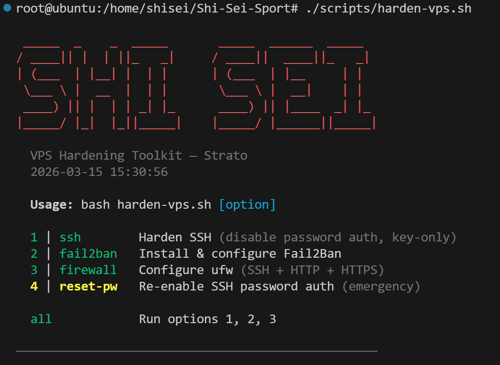
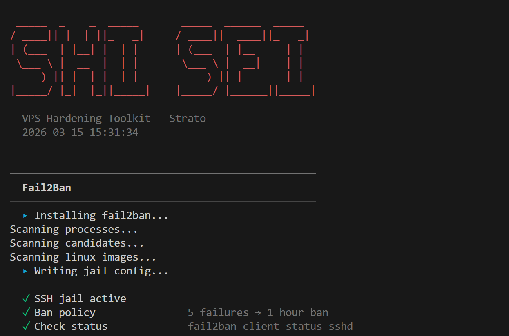
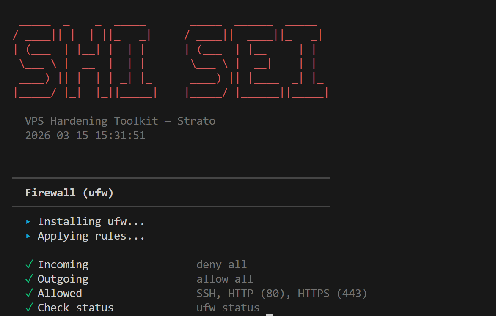

# Security Policy

## Reporting a Vulnerability

If you discover a security vulnerability in this project, please report it responsibly. **Do not open a public GitHub issue.**

### How to Report

Send an email to the repository owner with:

- A description of the vulnerability
- Steps to reproduce the issue
- The potential impact
- Any suggested fixes (optional)

You can find the contact information on the [GitHub profile](https://github.com/kevin-rn) of the repository owner.

### What to Expect

- **Acknowledgment** within 48 hours of your report
- **Assessment** of the vulnerability and its severity
- **Fix** developed and tested before any public disclosure
- **Credit** given to reporters in the fix commit (unless you prefer anonymity)

## Scope

The following are in scope for security reports:

- Authentication and authorization issues in the Payload CMS admin panel
- Input validation bypasses (XSS, SQL injection, CSRF)
- Rate limiting bypasses on form endpoints
- CAPTCHA (Altcha) verification bypasses
- Information disclosure through API endpoints
- Email injection or header manipulation
- Server-side request forgery (SSRF)
- File upload vulnerabilities via MinIO/S3

## Out of Scope

- Denial of service attacks
- Social engineering
- Issues in third-party dependencies (report these to the respective maintainers)
- Issues requiring physical access to the server

## Security Measures

This project implements the following security measures:

- **HTTPS** enforced via Caddy with automatic Let's Encrypt certificates
- **Security headers**: CSP, X-Frame-Options: DENY, X-Content-Type-Options: nosniff, HSTS, Permissions-Policy
- **Rate limiting** on all form endpoints (in-memory per-IP)
- **CAPTCHA** (Altcha proof-of-work) on contact, enrollment, and trial lesson forms
- **Input validation** on both client and server side
- **HTML escaping** in all email templates
- **Request body size limit** (10MB) enforced by Caddy
- **Privacy-friendly analytics** with no cookies and no PII storage
- **VPS hardening script** for SSH, fail2ban, and firewall configuration

## VPS Hardening Script

The project includes `scripts/harden-vps.sh` for server-side security hardening. Run `bash harden-vps.sh` to see available options.

### SSH Hardening

Disables password authentication, enforces key-only login, limits auth attempts, and disables X11/agent forwarding.

### Fail2Ban

Installs and configures fail2ban with an SSH jail (5 failed attempts = 1 hour ban).

### Firewall (ufw)

Configures ufw to deny all incoming traffic except SSH, HTTP (80), and HTTPS (443).

